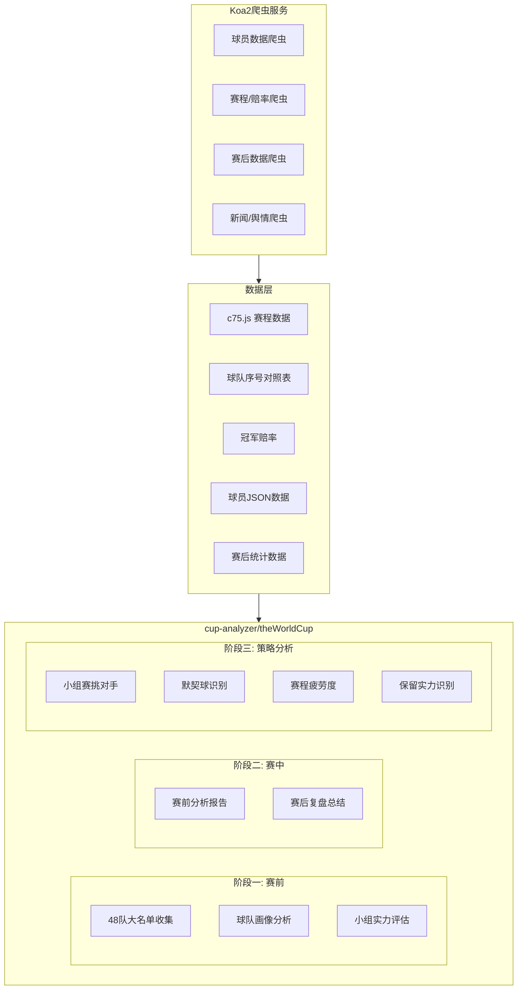
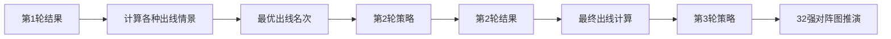
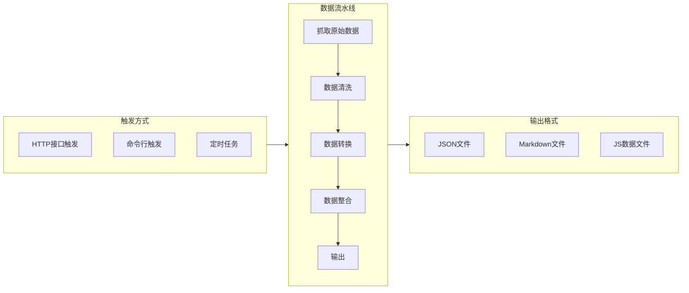

# 2026世界杯分析项目方案

> 这份计划是持续迭代的文档，随时可以修改和补充新想法。
> 最后更新: 2026-04-06

## 一、项目全景



## 二、实施进度

| 任务 | 状态 | 说明 |
|------|------|------|
| 初始化 crawler-server Koa2项目 | ✅ 已完成 | package.json、app.js入口、路由结构、config配置 |
| 实现爬虫基类和工具函数 | ✅ 已完成 | HTTP封装、cheerio解析、eval解析、文件输出 |
| 实现大名单爬虫 | ✅ 已完成 | 批量爬取48队26人名单，输出JSON |
| 实现大名单处理器 | ✅ 已完成 | 清洗数据，按小组生成Markdown |
| 实现球队画像生成器 | ✅ 已完成 | 自动分析年龄/身高/身价/位置深度/打法/目标 |
| 建立策略分析框架 | ✅ 已完成 | 出线路径、挑对手、默契球、赛程疲劳度 |
| 创建世界杯专用SKILL文件 | ✅ 已完成 | 适配无盘路榜、国家队档次等 |
| 实现赛后数据爬虫和赔率爬虫 | ✅ 已完成 | 复用crawlerPostMatchData.js逻辑 |
| 更新README和workflow文档 | ✅ 已完成 | 项目说明文档 |

## 三、目录结构规划

在现有 `cup-analyzer/theWorldCup/` 基础上扩展：

```
cup-analyzer/
├── README.md                          # 已有，需补充
└── theWorldCup/
    ├── PLAN.md                        # 本文件（项目计划）
    ├── workflow.md                     # 已有，需完善
    ├── rule/
    │   ├── group-stage-rule.md         # 已有
    │   └── 16th-finals-rule.md         # 已有
    ├── data/
    │   ├── c75.js                      # 已有，赛程数据
    │   ├── 冠军赔率.md                  # 已有
    │   └── 球队与序号对照表.md           # 已有
    ├── squad/                          # 48队大名单
    │   ├── README.md                   # 大名单数据说明
    │   ├── group-A/
    │   │   ├── 墨西哥.md
    │   │   ├── 南非.md
    │   │   ├── 韩国.md
    │   │   └── 欧洲附加D胜者.md
    │   ├── group-B/
    │   │   └── ...
    │   └── ...                         # A-L共12个小组
    ├── teamProfile/                    # 球队画像
    │   ├── README.md                   # 画像分析模板说明
    │   └── {球队名}.md                  # 每队一个画像文件
    ├── report/                         # 赛前分析报告
    │   ├── group-stage/
    │   │   ├── round-1/
    │   │   │   └── {主队}_vs_{客队}.md
    │   │   ├── round-2/
    │   │   └── round-3/
    │   ├── round-of-32/
    │   ├── round-of-16/
    │   ├── quarter-finals/
    │   ├── semi-finals/
    │   └── final/
    ├── postMatchSummary/               # 赛后复盘
    │   └── (同report结构)
    ├── strategy/                       # 策略分析
    │   ├── README.md
    │   ├── group-path-analysis.md      # 小组出线路径
    │   ├── opponent-selection.md       # 挑对手策略
    │   ├── tacit-match-detection.md    # 默契球识别
    │   └── fatigue-schedule.md         # 赛程疲劳度分析
    ├── description/                    # 球队简介(AI只读)
    │   └── {球队名}.md
    └── news/                           # 比赛素材
        └── {阶段}/{对阵}/
            ├── 统计信息.md
            ├── {主队}大名单.md
            └── {客队}大名单.md
```

爬虫服务独立项目：

```
cup-analyzer/
└── crawler-server/                    # Koa2爬虫服务
    ├── package.json
    ├── app.js                         # Koa2入口
    ├── config/
    │   ├── index.js                   # 全局配置
    │   └── targets.js                 # 爬取目标网站配置
    ├── routes/
    │   ├── index.js                   # 路由汇总
    │   ├── squad.js                   # 大名单相关接口
    │   ├── match.js                   # 比赛数据相关接口
    │   └── schedule.js                # 赛程相关接口
    ├── crawlers/                      # 爬虫核心逻辑
    │   ├── base.js                    # 基类：请求/解析/重试
    │   ├── squadCrawler.js            # 球队大名单爬虫
    │   ├── matchDataCrawler.js        # 赛后数据爬虫
    │   ├── oddsCrawler.js             # 赔率/盘口爬虫
    │   └── scheduleCrawler.js         # 赛程更新爬虫
    ├── processors/                    # 数据清洗/整合
    │   ├── squadProcessor.js          # 大名单清洗
    │   ├── teamProfileGenerator.js    # 球队画像生成
    │   └── strategyAnalyzer.js        # 策略数据计算
    ├── utils/
    │   ├── http.js                    # axios封装(复用backend-server模式)
    │   ├── parser.js                  # cheerio/eval解析
    │   └── fileWriter.js              # 文件输出(JSON/MD)
    └── output/                        # 爬虫输出中转目录
        ├── player_center/
        └── basicData/
```

## 四、三大阶段详细方案

### 阶段一：赛前球队分析（世界杯开始前）

**目标**：为48支参赛队建立完整的数据画像

**1. 大名单数据采集** -- 每队26人

每个球员需要的字段：

- 球衣号、姓名（中/英）、年龄、身高(cm)、体重(kg)
- 场上位置（GK/CB/RB/LB/CDM/CM/CAM/LW/RW/ST等）
- 所属俱乐部、身价（万欧元）
- 本赛季俱乐部数据：出场数、首发数、进球、助攻、黄牌、红牌
- 国家队数据：出场数、进球数

**数据来源**：复用已有的 `backend-server/crawlerPlayer.js` 模式，从球探体育(titan007)的 `teamDetail/tdl{serial}.js` 接口获取，用 `球队与序号对照表.md` 中的序号。

**2. 球队画像生成** -- 每队一份 `teamProfile/{队名}.md`

从大名单数据自动推算：

- **年龄结构**：平均年龄、年龄分布（年轻/当打/老将比例）→ 判断经验值和体能
- **身高分析**：平均身高、高点数量 → 判断定位球能力和空中对抗
- **身价分析**：总身价、平均身价、身价TOP5 → 判断整体硬实力档次
- **位置深度**：每个位置有几人可用、核心球员替补质量 → 判断抗伤病能力
- **打法推断**：结合阵型、球员特点推断可能的战术体系（控球/反击/高位逼抢等）
- **球队目标**：结合身价档次 + 冠军赔率 → 判定目标（夺冠/四强/八强/小组出线/陪跑）

**3. 小组实力评估**

对12个小组逐一分析：

- 小组内四队实力对比（身价差、世界排名差）
- 出线概率预判
- "死亡之组"和"幸运之组"识别

### 阶段二：赛中逐场分析（复用league-analyzer模式）

**赛前分析**：复用现有 `dh-match-predict-analysis` SKILL 的工作流，适配世界杯场景：

- 搜集双方大名单 → 预测首发 → 交锋/近况 → 盘口解析 → 综合判断
- 报告存放在 `cup-analyzer/theWorldCup/report/{阶段}/{轮次}/{主队}_vs_{客队}.md`

**赛后复盘**：复用现有 `dh-post-match-analysis` SKILL 的多专家深度分析流程：

- 爬取赛后数据 → 多专家并行分析 → 统一综合呈现
- 总结存放在 `cup-analyzer/theWorldCup/postMatchSummary/{阶段}/{轮次}/{主队}_vs_{客队}.md`

**与联赛分析的关键差异**：

- 无盘路榜（世界杯场次太少），需用球队联赛赛季的盘路数据作参考
- 广实定位需要重新建立（国家队档次 vs 俱乐部档次不同）
- 国家队球员磨合度 < 俱乐部，需额外考虑

### 阶段三：世界杯独特策略分析

**1. 小组赛挑对手分析（第2、3轮）**



核心逻辑：

- 读取 `16th-finals-rule.md` 中的上下半区对阵规则
- 小组第1、第2、最佳第3的淘汰赛路径不同
- 冠军级球队会选择更有利的半区路径 → 可能在第3轮控制比分

**2. 默契球识别模型**

触发条件检测：

- 同组最后一轮，两队同时开赛
- 某个特定比分对双方都有利（如双方都出线）
- 双方无仇恨、无利益冲突
- 历史上有默契球先例的国家队组合

**3. 赛程疲劳度分析**

- 计算每支球队两场比赛之间的间隔天数
- 标记"背靠背"紧密赛程（间隔 <= 3天）
- 叠加旅行距离（美国/加拿大/墨西哥跨时区）
- 综合评估轮换可能性和体能影响

**4. 保留实力识别**

信号指标：

- 已确定出线/淘汰 → 第3轮可能保留
- 淘汰赛对手已确定且较弱 → 可能保留
- 赛程紧密 + 后面对手强 → 可能保留主力
- 历史上该国家队是否有"保留实力"的传统

## 五、Koa2爬虫服务方案

### 技术栈

- **Koa2** + **koa-router** + **koa-bodyparser**：Web框架
- **axios**：HTTP请求（复用 `backend-server/utils/utils.js` 中的 `service` 封装模式）
- **cheerio**：HTML解析
- **iconv-lite**：编码转换
- **node-schedule**：定时任务（赛期自动抓取）

### 工作流设计



### 爬虫复用策略

已有的 `backend-server` 爬虫模式非常成熟，新的Koa2服务将：

- **复用**：axios封装、cheerio解析模式、eval解析.js数据文件的方式、titan007数据源
- **新增**：Koa2路由层（替代Express）、流水线式数据处理、定时任务、更结构化的输出
- **改进**：将现有散落的 `crawlerPlayer.js`、`crawlerPostMatchData.js` 等逻辑抽象为可复用的爬虫基类

### 关键接口设计

| 接口                              | 方法   | 功能         |
| ------------------------------- | ---- | ---------- |
| `/api/squad/crawl/:teamSerial`  | POST | 爬取指定球队大名单  |
| `/api/squad/crawl-all`          | POST | 批量爬取48队大名单 |
| `/api/squad/profile/:teamName`  | GET  | 获取球队画像     |
| `/api/match/pre-data/:matchId`  | POST | 爬取赛前数据     |
| `/api/match/post-data/:matchId` | POST | 爬取赛后数据     |
| `/api/schedule/update`          | POST | 更新赛程和比分    |
| `/api/odds/update/:matchId`     | POST | 更新盘口赔率     |
| `/api/strategy/group-path`      | GET  | 小组出线路径分析   |

## 六、实施顺序

由于世界杯2026年6月11日开赛，建议按以下顺序推进：

1. **先搭建 crawler-server 骨架**：Koa2项目初始化、基类、工具函数 ✅
2. **实现大名单爬虫**：复用crawlerPlayer.js逻辑，适配国家队 ✅
3. **建立 squad/ 目录**：48队大名单 Markdown 文件 ✅
4. **实现球队画像生成**：从大名单数据自动分析 ✅
5. **建立 strategy/ 目录**：出线路径、挑对手策略等分析框架 ✅
6. **赛前/赛后分析流程**：复用现有SKILL，创建世界杯专用SKILL ✅
7. **定时任务和自动化**：赛期自动抓取比分、赔率更新（待实现）

---

## 七、待补充 / 新想法

> 在这里随时记录碎片化的想法，后续逐步整理到上面的正式方案中

- 
- 
- 
